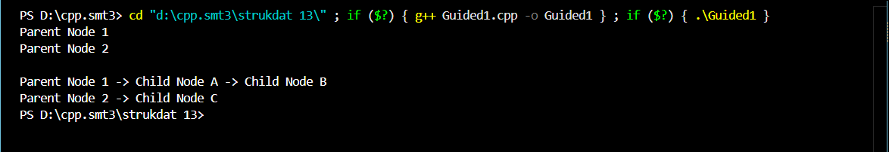

# <h1 align="center">Laporan Praktikum Modul 13 <br>MULTI LINKED LIST</h1>
<p align="center">RIZKI WIDODO - 103112400136</p>

## Dasar Teori
Multi Linked List merupakan struktur data yang terdiri dari beberapa linked list yang saling terhubung, di mana setiap elemen dapat menjadi bagian dari lebih dari satu list secara bersamaan. Dalam implementasinya, terdapat konsep list induk (parent list) dan list anak (child list), di mana setiap elemen pada list induk dapat menunjuk ke sebuah list anak yang terpisah. Struktur ini memungkinkan representasi data hierarkis atau relasional, seperti data pegawai yang memiliki beberapa data anak. Operasi dasar seperti insert dan delete pada multi linked list memerlukan penanganan khusus karena harus mempertimbangkan keterhubungan antar list, misalnya saat menambahkan atau menghapus elemen anak harus diketahui terlebih dahulu elemen induknya, dan penghapusan elemen induk harus diikuti penghapusan seluruh elemen anak yang terkait. Implementasi multi linked list umumnya menggunakan struktur data pointer dalam bahasa pemrograman C dengan mendefinisikan tipe data untuk elemen induk dan anak beserta prosedur-prosedur untuk alokasi, dealokasi, pencarian, serta manipulasi list.
## Guided

### Guided 1
```c++
#include <iostream>
#include <string>
using namespace std;

struct ChildNode
{
    string info;
    ChildNode *next;
};

struct ParentNode
{
    string info;
    ChildNode *childHead;
    ParentNode *next;
};

ParentNode *createParent(string info)
{
    ParentNode *newNode = new ParentNode;
    newNode->info = info;
    newNode->childHead = NULL;
    newNode->next = NULL;
    return newNode;
}

ChildNode *createChild(string info)
{
    ChildNode *newNode = new ChildNode;
    newNode->info = info;
    newNode->next = NULL;
    return newNode;
}

void insertParent(ParentNode *&head, string info)
{
    ParentNode *newNode = createParent(info);
    if (head == NULL)
    {
        head = newNode;
    }
    else
    {
        ParentNode *temp = head;
        while (temp->next != NULL)
        {
            temp = temp->next;
        }
        temp->next = newNode;
    }
}

void insertChild(ParentNode *head, string parentInfo, string childInfo)
{
    ParentNode *p = head;
    while (p != NULL && p->info != parentInfo)
    {
        p = p->next;
    }
    
    if (p != NULL)
    {
        ChildNode *newChild = createChild(childInfo);
        
        if (p->childHead == NULL)
        {
            p->childHead = newChild;
        }
        else
        {
            ChildNode *c = p->childHead;
            while (c->next != NULL)
            {
                c = c->next;
            }
            c->next = newChild;
        }
    }
}

void printAll(ParentNode *head)
{
    ParentNode *p = head;
    while (p != NULL)
    {
        cout << p->info;
        ChildNode *c = p->childHead;
        if (c != NULL)
        {
            while (c != NULL)
            {
                cout << " -> " << c->info;
                c = c->next;
            }
        }
     cout << endl;
        p = p->next;
    }
}

int main()
{
    ParentNode *list = NULL;
    
    insertParent(list, "Parent Node 1");
    insertParent(list, "Parent Node 2");
    
    printAll(list);
    cout << "\n";
    
    insertChild(list, "Parent Node 1", "Child Node A");
    insertChild(list, "Parent Node 1", "Child Node B");
    insertChild(list, "Parent Node 2", "Child Node C");
    
    printAll(list);
    
    return 0;
}
```

> Output
> 
> 
program menampilkan struktur Multi Linked List sederhana yang terdiri dari dua node induk (Parent Node 1 dan Parent Node 2). Parent Node 1 memiliki dua anak, yaitu Child Node A dan Child Node B, sedangkan Parent Node 2 memiliki satu anak, yaitu Child Node C. Hasil ini menunjukkan bagaimana list induk dapat menyimpan referensi ke beberapa list anak secara terpisah, menggambarkan hubungan satu ke banyak antar data.

## UNGUIDED 
1. Perhatikan program 46 multilist.h, buat multilist.cpp untuk implementasi semua fungsi pada 
multilist.h. Buat main.cpp untuk pemanggilan fungsi-fungsi tersebut.

#### multilist.h
```c++
#ifndef MULTILIST_H_INCLUDED
#define MULTILIST_H_INCLUDED

#include <iostream>
#include <string>
#define Nil NULL

using namespace std;

typedef int infotypeinduk;
typedef string infotypeanak; 

typedef struct elemen_list_induk *address;
typedef struct elemen_list_anak *address_anak;

struct elemen_list_anak {
    infotypeanak info;
    address_anak next;
    address_anak prev;
};

struct listanak {
    address_anak first;
    address_anak last;
};

struct elemen_list_induk {
    infotypeinduk info;
    listanak lanak;
    address next;
    address prev;
};

struct listinduk {
    address first;
    address last;
};

bool ListEmpty(listinduk L);
bool ListEmptyAnak(listanak L);

void CreateList(listinduk &L);
void CreateListAnak(listanak &L);

address alokasi(infotypeinduk X);
address_anak alokasiAnak(infotypeanak X);
void dealokasi(address P);
void dealokasiAnak(address_anak P);

address findElm(listinduk L, infotypeinduk X);
address_anak findElmAnak(listanak L, infotypeanak X);

void insertFirst(listinduk &L, address P);
void insertLast(listinduk &L, address P);
void insertAfter(listinduk &L, address P, address Prec);

void insertFirstAnak(listanak &L, address_anak P);
void insertLastAnak(listanak &L, address_anak P);
void insertAfterAnak(listanak &L, address_anak P, address_anak Prec);

void delFirst(listinduk &L, address &P);
void delLast(listinduk &L, address &P);
void delAfter(listinduk &L, address &P, address Prec);
void delP(listinduk &L, infotypeinduk X);

void delFirstAnak(listanak &L, address_anak &P);
void delLastAnak(listanak &L, address_anak &P);
void delAfterAnak(listanak &L, address_anak &P, address_anak Prec);
void delPAnak(listanak &L, infotypeanak X);

void printInfo(listinduk L);

#endif
```
#### multilist.cpp
```c++
#include "multilist.h"

bool ListEmpty(listinduk L) {
    return (L.first == Nil);
}

bool ListEmptyAnak(listanak L) {
    return (L.first == Nil);
}

void CreateList(listinduk &L) {
    L.first = Nil;
    L.last = Nil;
}

void CreateListAnak(listanak &L) {
    L.first = Nil;
    L.last = Nil;
}

address alokasi(infotypeinduk X) {
    address P = new elemen_list_induk;
    if (P != Nil) {
        P->info = X;
        CreateListAnak(P->lanak);
        P->next = Nil;
        P->prev = Nil;
    }
    return P;
}

address_anak alokasiAnak(infotypeanak X) {
    address_anak P = new elemen_list_anak;
    if (P != Nil) {
        P->info = X;
        P->next = Nil;
        P->prev = Nil;
    }
    return P;
}

void dealokasi(address P) {
    delete P;
}

void dealokasiAnak(address_anak P) {
    delete P;
}

address findElm(listinduk L, infotypeinduk X) {
    address P = L.first;
    while (P != Nil) {
        if (P->info == X) return P;
        P = P->next;
    }
    return Nil;
}

address_anak findElmAnak(listanak L, infotypeanak X) {
    address_anak P = L.first;
    while (P != Nil) {
        if (P->info == X) return P;
        P = P->next;
    }
    return Nil;
}

void insertFirst(listinduk &L, address P) {
    if (ListEmpty(L)) {
        L.first = P;
        L.last = P;
    } else {
        P->next = L.first;
        L.first->prev = P;
        L.first = P;
    }
}

void insertLast(listinduk &L, address P) {
    if (ListEmpty(L)) {
        L.first = P;
        L.last = P;
    } else {
        P->prev = L.last;
        L.last->next = P;
        L.last = P;
    }
}

void insertAfter(listinduk &L, address P, address Prec) {
    if (Prec != Nil) {
        P->next = Prec->next;
        P->prev = Prec;
        if (Prec->next != Nil) {
            Prec->next->prev = P;
        } else {
            L.last = P;
        }
        Prec->next = P;
    }
}

void insertFirstAnak(listanak &L, address_anak P) {
    if (ListEmptyAnak(L)) {
        L.first = P;
        L.last = P;
    } else {
        P->next = L.first;
        L.first->prev = P;
        L.first = P;
    }
}

void insertLastAnak(listanak &L, address_anak P) {
    if (ListEmptyAnak(L)) {
        L.first = P;
        L.last = P;
    } else {
        P->prev = L.last;
        L.last->next = P;
        L.last = P;
    }
}

void delFirstAnak(listanak &L, address_anak &P) {
    P = L.first;
    if (P != Nil) {
        if (L.first == L.last) {
            L.first = Nil;
            L.last = Nil;
        } else {
            L.first = P->next;
            L.first->prev = Nil;
            P->next = Nil;
        }
    }
}

void delLastAnak(listanak &L, address_anak &P) {
    P = L.last;
    if (P != Nil) {
        if (L.first == L.last) {
            L.first = Nil;
            L.last = Nil;
        } else {
            L.last = P->prev;
            L.last->next = Nil;
            P->prev = Nil;
        }
    }
}

void delPAnak(listanak &L, infotypeanak X) {
    address_anak P = findElmAnak(L, X);
    if (P != Nil) {
        if (P == L.first) {
            delFirstAnak(L, P);
        } else if (P == L.last) {
            delLastAnak(L, P);
        } else {
            P->prev->next = P->next;
            P->next->prev = P->prev;
            P->next = Nil;
            P->prev = Nil;
        }
        dealokasiAnak(P);
    }
}

void delFirst(listinduk &L, address &P) {
    P = L.first;
    if (P != Nil) {
        address_anak ChildNode;
        while (!ListEmptyAnak(P->lanak)) {
            delFirstAnak(P->lanak, ChildNode);
            dealokasiAnak(ChildNode);
        }
        
        if (L.first == L.last) {
            L.first = Nil;
            L.last = Nil;
        } else {
            L.first = P->next;
            L.first->prev = Nil;
            P->next = Nil;
        }
    }
}

void delP(listinduk &L, infotypeinduk X) {
    address P = findElm(L, X);
    if (P != Nil) {
        address Dummy;
        if (P == L.first) {
            delFirst(L, Dummy); 
        } else if (P == L.last) {
            delLast(L, Dummy); 
        } else {
            address_anak ChildNode;
            while (!ListEmptyAnak(P->lanak)) {
                delFirstAnak(P->lanak, ChildNode);
                dealokasiAnak(ChildNode);
            }
            
            P->prev->next = P->next;
            P->next->prev = P->prev;
            P->next = Nil;
            P->prev = Nil;
        }
        dealokasi(P);
    }
}

void delLast(listinduk &L, address &P) {
    P = L.last;
    if(P != Nil){
        address_anak ChildNode;
        while (!ListEmptyAnak(P->lanak)) {
            delFirstAnak(P->lanak, ChildNode);
            dealokasiAnak(ChildNode);
        }

        if(L.first == L.last){
            L.first = Nil; 
            L.last = Nil;
        } else {
            L.last = P->prev;
            L.last->next = Nil;
            P->prev = Nil;
        }
    }
}

void printInfo(listinduk L) {
    address P = L.first;
    if (ListEmpty(L)) {
        cout << "List Kosong." << endl;
    } else {
        while (P != Nil) {
            cout << "[Pegawai ID: " << P->info << "] -> Anak: ";
            address_anak Q = P->lanak.first;
            if (Q == Nil) {
                cout << "(Tidak ada anak)";
            } else {
                while (Q != Nil) {
                    cout << Q->info << ", ";
                    Q = Q->next;
                }
            }
            cout << endl;
            P = P->next;
        }
    }
}
```
#### main.cpp
```c++
#include "multilist.h"

int main() {
    listinduk L;
    CreateList(L);

    cout << "=== DEMO MULTI LINKED LIST ===" << endl;

    address P1 = alokasi(101);
    insertLast(L, P1);
    
    address P2 = alokasi(102);
    insertLast(L, P2);

    address P3 = alokasi(103);
    insertLast(L, P3);

    insertLastAnak(P1->lanak, alokasiAnak("Budi"));
    insertLastAnak(P1->lanak, alokasiAnak("Ani"));

    insertLastAnak(P2->lanak, alokasiAnak("Siti"));

    cout << "\nData Awal:" << endl;
    printInfo(L);

    cout << "\nMenghapus anak 'Budi' dari Pegawai 101..." << endl;
    delPAnak(P1->lanak, "Budi");
    printInfo(L);

    cout << "\nMenghapus Pegawai 102 (beserta anaknya 'Siti')..." << endl;
    delP(L, 102);
    printInfo(L);

    return 0;
}
```
> Output soal 1
> 
> 
program menampilkan berupa data pegawai dan anak-anaknya. Misalnya, Pegawai dengan ID 101 memiliki anak “Budi” dan “Ani”, Pegawai 102 memiliki anak “Siti”, dan Pegawai 103 tidak memiliki anak. Setelah dilakukan operasi penghapusan (delete child dan delete parent), hasil menunjukkan bahwa penghapusan anak hanya menghapus anak tertentu dari induknya, sedangkan penghapusan induk akan sekaligus menghapus seluruh anak yang terhubung dengannya. Ini memperlihatkan implementasi logika penghapusan yang konsisten dalam struktur Multi Linked List.

2. Implementasikan ADT Multi Linked List dan ADT Linked List untuk studi kasus data mahasiswa (Nama, NIM, Jenis Kelamin, IPK) beserta seluruh operasi manipulasi data (insert, delete, find, print) menggunakan bahasa C++ sesuai spesifikasi header yang diberikan.

#### multilist.h
```c++
#ifndef CIRCULARLIST_H_INCLUDED
#define CIRCULARLIST_H_INCLUDED

#include <iostream>
#include <string>
#define Nil NULL

using namespace std;

struct mahasiswa {
    string nama;
    string nim;
    char jenis_kelamin;
    float ipk;
};

typedef mahasiswa infotype;
typedef struct ElmList *address;

struct ElmList {
    infotype info;
    address next;
    address prev;
};

struct List {
    address first;
    address last;
};

void createList(List &L);
address alokasi(infotype x);
void dealokasi(address P);
void insertFirst(List &L, address P);
void insertLast(List &L, address P);
void insertAfter(List &L, address Prec, address P);
void deleteFirst(List &L, address &P);
void deleteLast(List &L, address &P);
void deleteAfter(List &L, address Prec, address &P);
address findElm(List L, string nim);
void printInfo(List L);

address createData(string nama, string nim, char jenis_kelamin, float ipk);

#endif
```
#### multi list.cpp
```c++
#include "circularlist.h"

void createList(List &L) {
    L.first = Nil;
    L.last = Nil;
}

address alokasi(infotype x) {
    address P = new ElmList;
    if (P != Nil) {
        P->info = x;
        P->next = Nil;
        P->prev = Nil;
    }
    return P;
}

address createData(string nama, string nim, char jenis_kelamin, float ipk) {
    infotype x;
    address P;
    x.nama = nama;
    x.nim = nim;
    x.jenis_kelamin = jenis_kelamin;
    x.ipk = ipk;
    P = alokasi(x);
    return P;
}

void dealokasi(address P) {
    delete P;
}

void insertFirst(List &L, address P) {
    if (L.first == Nil) {
        L.first = P;
        L.last = P;
        P->next = P;
        P->prev = P;
    } else {
        P->next = L.first;
        P->prev = L.last;
        L.first->prev = P;
        L.last->next = P;
        L.first = P;
    }
}

void insertLast(List &L, address P) {
    if (L.first == Nil) {
        L.first = P;
        L.last = P;
        P->next = P;
        P->prev = P;
    } else {
        P->next = L.first;
        P->prev = L.last;
        L.last->next = P;
        L.first->prev = P;
        L.last = P;
    }
}

void insertAfter(List &L, address Prec, address P) {
    if (Prec != Nil) {
        P->next = Prec->next;
        P->prev = Prec;
        Prec->next->prev = P;
        Prec->next = P;
        
        if (Prec == L.last) {
            L.last = P;
        }
    }
}

void deleteFirst(List &L, address &P) {
    P = L.first;
    if (P != Nil) {
        if (L.first == L.last) { 
            L.first = Nil;
            L.last = Nil;
        } else {
            L.first = P->next;
            L.first->prev = L.last;
            L.last->next = L.first;
        }
        P->next = Nil;
        P->prev = Nil;
    }
}

void deleteLast(List &L, address &P) {
    P = L.last;
    if (P != Nil) {
        if (L.first == L.last) {
            L.first = Nil;
            L.last = Nil;
        } else {
            L.last = P->prev;
            L.last->next = L.first;
            L.first->prev = L.last;
        }
        P->next = Nil;
        P->prev = Nil;
    }
}

void deleteAfter(List &L, address Prec, address &P) {
    if (Prec != Nil && Prec->next != Prec) { 
        P = Prec->next;
        Prec->next = P->next;
        P->next->prev = Prec;
        
        if (P == L.last) {
            L.last = Prec;
        } else if (P == L.first) {
            L.first = P->next;
        }
        
        P->next = Nil;
        P->prev = Nil;
    }
}

address findElm(List L, string nim) {
    if (L.first == Nil) return Nil;
    
    address P = L.first;
    do {
        if (P->info.nim == nim) return P;
        P = P->next;
    } while (P != L.first); 
    
    return Nil;
}

void printInfo(List L) {
    if (L.first == Nil) {
        cout << "List Kosong" << endl;
    } else {
        address P = L.first;
        do {
            cout << "Nama : " << P->info.nama << endl;
            cout << "NIM  : " << P->info.nim << endl;
            cout << "L/P  : " << P->info.jenis_kelamin << endl;
            cout << "IPK  : " << P->info.ipk << endl;
            cout << endl;
            P = P->next;
        } while (P != L.first); 
}
```
#### main.cpp
```c++
#include <iostream>
#include "circularlist.h"

using namespace std;

int main() {
    List L;
    address P1 = Nil;
    address P2 = Nil;
    infotype x;
    
    createList(L);
    cout << "coba insert first, last, dan after" << endl;
    
    P1 = createData("Danu", "04", 'l', 4);
    insertFirst(L, P1);
    
    P1 = createData("Fahmi", "06", 'l', 3.45);
    insertLast(L, P1);
    
    P1 = createData("Bobi", "02", 'l', 3.71);
    insertFirst(L, P1);
    
    P1 = createData("Ali", "01", 'l', 3.3);
    insertFirst(L, P1);
    
    P1 = createData("Gita", "07", 'p', 3.75);
    insertLast(L, P1);
    
    x.nim = "02"; 
    P1 = findElm(L, x.nim);
    if(P1 != Nil) {
        P2 = createData("Cindi", "03", 'p', 3.5);
        insertAfter(L, P1, P2);
    }
    
    x.nim = "04"; 
    P1 = findElm(L, x.nim);
    if(P1 != Nil) {
        P2 = createData("Eli", "05", 'p', 3.4);
        insertAfter(L, P1, P2);
    }
    
    x.nim = "07"; 
    P1 = findElm(L, x.nim);
    if(P1 != Nil) {
        P2 = createData("Hilmi", "08", 'l', 3.3);
        insertAfter(L, P1, P2);
    }
    
    printInfo(L);
    
    return 0;
}
```

> Output soal 2
>
> 
Circular Linked List yang digunakan untuk mengelola data mahasiswa. Program berhasil melakukan operasi insert first, insert last, dan insert after untuk menambahkan data mahasiswa seperti Ali, Bobi, Cindi, Danu, Eli, dan seterusnya. Setiap data menampilkan atribut Nama, NIM, Jenis Kelamin, dan IPK. Hasil ini membuktikan bahwa struktur Circular Linked List bekerja dengan baik untuk menyisipkan data di berbagai posisi dalam list dan membentuk siklus data yang saling terhubung.


## Referensi

1. https://www.geeksforgeeks.org/multilist-in-data-structure/ (diakses pada 8 Desember 2025)
2. https://www.tutorialspoint.com/data_structures_algorithms/linked_list_algorithms.htm (diakses pada 8 Desember 2025)
3. https://www.programiz.com/dsa/linked-list (diakses pada 8 Desember 2025)
