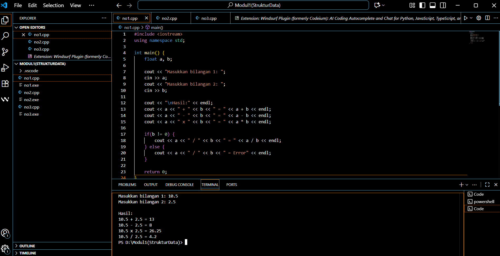
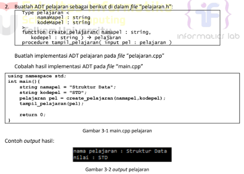

# <h1 align="center">Laporan Praktikum Modul 3 <br> Pengenalan C++ </h1>
<p align="center">RIZKI WIDODO - 103112400136 </p>

## Dasar Teori

Abstract Data Type (ADT) merupakan konsep dalam pemrograman yang mendefinisikan sebuah tipe data beserta sekumpulan operasi primitif yang dapat dilakukan pada tipe data tersebut, tanpa mengekspos detail implementasi internalnya. ADT berfokus pada "apa" yang dilakukan oleh operasi tersebut而不是 "bagaimana" cara melakukannya, sehingga memisahkan antara spesifikasi perilaku dengan implementasi nyata. Dalam implementasinya, ADT biasanya direalisasikan menjadi dua modul utama: file header (.h) yang berisi deklarasi tipe data dan prototipe fungsi/prosedur, serta file implementasi (.cpp) yang berisi kode detail dari setiap operasi primitif. Konsep ini memungkinkan pengguna untuk berinteraksi dengan tipe data hanya melalui antarmuka yang telah ditentukan, meningkatkan modularitas, abstraksi, dan kemudahan maintenance dalam pengembangan perangkat lunak.


## Guided

### Soal 1

Buat program yang dapat menyimpan data mahasiswa (max. 10) ke dalam sebuah array
dengan field nama, nim, uts, uas, tugas, dan nilai akhir. Nilai akhir diperoleh dari FUNGSI 
dengan rumus 0.3*uts+0.4*uas+0.3*tugas.

```go
#include <iostream>
#include <string>
using namespace std;

struct Mahasiswa {
    string nama;
    string nim;
    float uts;
    float uas;
    float tugas;
    float nilaiAkhir;
};

float hitungNilaiAkhir(float uts, float uas, float tugas) {
    return 0.3*uts + 0.4*uas + 0.3*tugas;
}

int main() {
    Mahasiswa data[10];
    int jumlah = 0;
    int pilihan;
    
    do {
        cout << "\nMenu Data Mahasiswa";
        cout << "\n1. Tambah Data";
        cout << "\n2. Tampilkan Data";
        cout << "\n3. Keluar";
        cout << "\nPilihan: ";
        cin >> pilihan;
        
        if (pilihan == 1) {
            if (jumlah < 10) {
                cout << "\nNama: ";
                cin.ignore();
                getline(cin, data[jumlah].nama);
                cout << "NIM: ";
                getline(cin, data[jumlah].nim);
                cout << "UTS: ";
                cin >> data[jumlah].uts;
                cout << "UAS: ";
                cin >> data[jumlah].uas;
                cout << "Tugas: ";
                cin >> data[jumlah].tugas;
                
                data[jumlah].nilaiAkhir = hitungNilaiAkhir(
                    data[jumlah].uts, data[jumlah].uas, data[jumlah].tugas);
                
                jumlah++;
                cout << "Data berhasil ditambahkan!\n";
            } else {
                cout << "Data sudah penuh!\n";
            }
        } else if (pilihan == 2) {
            cout << "\nData Mahasiswa:\n";
            for (int i = 0; i < jumlah; i++) {
                cout << i+1 << ". " << data[i].nama << " (" << data[i].nim 
                     << ") - Nilai Akhir: " << data[i].nilaiAkhir << endl;
            }
        }
    } while (pilihan != 3);
    
    return 0;
}

```
> Output
> 


Modul 3 ABSTRACT DATA TYPE (ADT)/Output/Soalno2.jpg
### Soal 2
> 


### pelajaran.cpp
```go
#include <iostream>
#include "pelajaran.h"

pelajaran create_pelajaran(string namapel, string kodepel) {
    pelajaran p;
    p.namakapel = namapel;
    p.kodewapel = kodepel;
    return p;
}

void tampli_pelajaran(pelajaran pel) {
    cout << "name pelajaran : " << pel.namakapel << endl;
    cout << "nilai : " << pel.kodewapel << endl;
}
```
### pelajaran.h
```go
#ifndef PELAJARAN_H
#define PELAJARAN_H

#include <string>
using namespace std;

struct pelajaran {
    string namakapel;
    string kodewapel;
};

pelajaran create_pelajaran(string namapel, string kodepel);
void tampli_pelajaran(pelajaran pel);

#endif
```

### main.cpp
```go
#include <iostream>
#include "pelajaran.h"
using namespace std;

int main() {
    string namapel = "$truktur Data";
    string kodepel = "$TD";
    pelajaran pel = create_pelajaran(namapel, kodepel);
    tampli_pelajaran(pel);
    return 0;
}
```

### Soal 3
```go
#include <iostream>
using namespace std;
int main()
{
    double tot_pembelian, diskon;
    cout << "total pembelian: Rp";
    cin >> tot_pembelian;
    diskon = 0;
    if (tot_pembelian >= 100000)
        diskon = 0.05 * tot_pembelian;
    cout << "besar diskon = Rp" << diskon;
}


int main()
{
    double tot_pembelian, diskon;
    cout << "total pembelian: Rp";
    cin >> tot_pembelian;
    diskon = 0;
    if (tot_pembelian >= 100000)
        diskon = 0.05 * tot_pembelian;
    else
        diskon = 0;
    cout << "besar diskon = Rp" << diskon;
}


int main()
{
    int kode_hari;
    cout << "Menentukan hari kerja/libur\n"<<endl;
    cout << "1=Senin 3=Rabu 5=Jumat 7=Minggu "<<endl;
    cout << "2=Selasa 4=Kamis 6=Sabtu "<<endl;
    cin >> kode_hari;
    switch (kode_hari)
    {
    case 1:
    case 2:
    case 3:
    case 4:
    case 5:
        cout<<"Hari Kerja";
        break;
    case 6:
    case 7:
        cout<<"Hari Libur";
        break;
    default:
        cout<<"Kode masukan salah!!!";
    }
    return 0;
}
```
### Soal 4
```go
#include <iostream>
using namespace std;
int main()
{
    int jum;
    cout << "jumlah perulangan: ";
    cin >> jum;
    for (int i = 0; i < jum; i++)
    {
        cout << "saya sahroni\n";
    }
    return 1;
}


int main()
{
    int i = 1;
    int jum;
    cin >> jum;
    do
    {
        cout << "bahlil ke-" << (i + 1) << endl;
        i++;
    } while (i < jum);
    return 0;
}
```
### Soal 5
```go
#include <iostream>
using namespace std;

// Prosedur: hanya menampilkan hasil, tidak mengembalikan nilai
void tampilkanHasil(double p, double l)
{
    cout << "\n=== Hasil Perhitungan ===" << endl;
    cout << "Panjang : " << p << endl;
    cout << "Lebar   : " << l << endl;
    cout << "Luas    : " << p * l << endl;
    cout << "Keliling: " << 2 * (p + l) << endl;
}

// Fungsi: mengembalikan nilai luas
double hitungLuas(double p, double l)
{
    return p * l;
}

// Fungsi: mengembalikan nilai keliling
double hitungKeliling(double p, double l)
{
    return 2 * (p + l);
}

int main()
{
    double panjang, lebar;

    cout << "Masukkan panjang: ";
    cin >> panjang;
    cout << "Masukkan lebar  : ";
    cin >> lebar;

    // Panggil fungsi
    double luas = hitungLuas(panjang, lebar);
    double keliling = hitungKeliling(panjang, lebar);

    cout << "\nDihitung dengan fungsi:" << endl;
    cout << "Luas      = " << luas << endl;
    cout << "Keliling  = " << keliling << endl;

    // Panggil prosedur
    tampilkanHasil(panjang, lebar);

    return 0;
}

```
### Soal 6
```go
#include <iostream>
using namespace std;
int main()
{
    string ch;
    cout << "Masukkan sebuah karakter: ";
    // cin >> ch;
    ch = getchar();  //Menggunakan getchar() untuk membaca satu karakter
    cout << "Karakter yang Anda masukkan adalah: " << ch << endl;
    return 0;
}
```


## Unguided

### Soal 1

Buatlah program yang menerima input-an dua buah bilangan betipe float, kemudian memberikan output-an hasil penjumlahan, pengurangan, perkalian, dan pembagian dari dua bilangan tersebut.


```go
#include <iostream>
using namespace std;

int main() {
    float a, b;
    
    cout << "Masukkan bilangan 1: ";
    cin >> a;
    cout << "Masukkan bilangan 2: ";
    cin >> b;
    
    cout << "\nHasil:" << endl;
    cout << a << " + " << b << " = " << a + b << endl;
    cout << a << " - " << b << " = " << a - b << endl;
    cout << a << " x " << b << " = " << a * b << endl;
    
    if(b != 0) {
        cout << a << " / " << b << " = " << a / b << endl;
    } else {
        cout << a << " / " << b << " = Error" << endl;
    }
    
    return 0;
}
```

> Output
> 

Penjelasan Kode
Program di atas meminta pengguna memasukkan dua bilangan, lalu menghitung penjumlahan, pengurangan, perkalian, dan pembagiannya. Hasil dari setiap operasi ditampilkan ke layar menggunakan cout, dan return 0; menandakan program selesai dengan normal.

### Soal 2

Buatlah sebuah program yang menerima masukan angka dan mengeluarkan output nilai angka tersebut dalam bentuk tulisan. Angka yang akan di- input-kan user adalah bilangan bulat positif mulai dari 0 s.d 100


```go
#include <iostream>
using namespace std;

int main() {
    int x;
    cin >> x;
    
    if(x == 0) cout << "nol";
    if(x == 1) cout << "satu";
    if(x == 2) cout << "dua";
    if(x == 3) cout << "tiga";
    if(x == 4) cout << "empat";
    if(x == 5) cout << "lima";
    if(x == 6) cout << "enam";
    if(x == 7) cout << "tujuh";
    if(x == 8) cout << "delapan";
    if(x == 9) cout << "sembilan";
    if(x == 10) cout << "sepuluh";
    if(x == 11) cout << "sebelas";
    if(x == 12) cout << "dua belas";
    if(x == 13) cout << "tiga belas";
    if(x == 14) cout << "empat belas";
    if(x == 15) cout << "lima belas";
    if(x == 16) cout << "enam belas";
    if(x == 17) cout << "tujuh belas";
    if(x == 18) cout << "delapan belas";
    if(x == 19) cout << "sembilan belas";
    if(x == 100) cout << "seratus";
    
    if(x >= 20 && x <= 99) {
        if(x/10 == 2) cout << "dua puluh";
        if(x/10 == 3) cout << "tiga puluh";
        if(x/10 == 4) cout << "empat puluh";
        if(x/10 == 5) cout << "lima puluh";
        if(x/10 == 6) cout << "enam puluh";
        if(x/10 == 7) cout << "tujuh puluh";
        if(x/10 == 8) cout << "delapan puluh";
        if(x/10 == 9) cout << "sembilan puluh";
        
        if(x%10 == 1) cout << " satu";
        if(x%10 == 2) cout << " dua";
        if(x%10 == 3) cout << " tiga";
        if(x%10 == 4) cout << " empat";
        if(x%10 == 5) cout << " lima";
        if(x%10 == 6) cout << " enam";
        if(x%10 == 7) cout << " tujuh";
        if(x%10 == 8) cout << " delapan";
        if(x%10 == 9) cout << " sembilan";
    }
    
    return 0;
}
```
> Output
> 

penjelasan kode
Program di atas digunakan untuk mengubah angka menjadi tulisan dalam bahasa Indonesia untuk rentang 0–100. Pertama, pengguna diminta memasukkan angka, lalu program mengecek apakah angka valid. Jika kurang dari 10, hasil diambil dari array satuan, jika 10–19 diambil dari array belasan, jika 20–99 dibentuk dari kata “puluh” ditambah satuan, dan khusus angka 100 ditampilkan sebagai “seratus”. Hasil akhirnya ditampilkan ke layar dalam bentuk angka dan teks.
Kalau adalanjutan di lanjut disini aja

soal nomor 3
Buatlah program yang dapat memberikan input dan output sbb.

```go
#include <iostream>
using namespace std;

int main() {
    int n;
    cout << "input: ";
    cin >> n;
    cout << "output: " << endl;
    
    
    for (int i = n; i >= 1; i--) {

        for (int j = 1; j <= n - i; j++) {
            cout << "  ";
        }        
        
        for (int j = i; j >= 1; j--) {
            cout << j << " ";
        }
        
        cout << "* ";

        for (int j = 1; j <= i; j++) {
            cout << j << " ";
        }
        
        cout << endl;
    }
    
    for (int i = 0; i < n; i++) {
        cout << "  ";
    }
    cout << "*" << endl;
    
    return 0;
}
```

> Output
> 

penjelasan kode
Program di atas meminta input sebuah angka n, lalu menampilkan pola berbentuk segitiga menurun dengan angka dari besar ke kecil di sebelah kiri, tanda * di tengah, dan angka dari kecil ke besar di sebelah kanan. Setiap baris bergeser ke kanan dengan spasi sesuai urutan, dan di bagian akhir program menambahkan satu * di bawah tengah pola.

## Referensi
1. https://www.w3schools.com/cpp/cpp_for_loop.asp
2. https://www.w3schools.com/cpp/cpp_conditions.asp
3. https://www.w3schools.com/cpp/cpp_conditions_elseif.asp
4. https://www.w3schools.com/cpp/cpp_conditions_else.asp
5. https://www.w3schools.com/cpp/cpp_variables_multiple.asp
6. https://www.w3schools.com/cpp/cpp_arrays.asp
