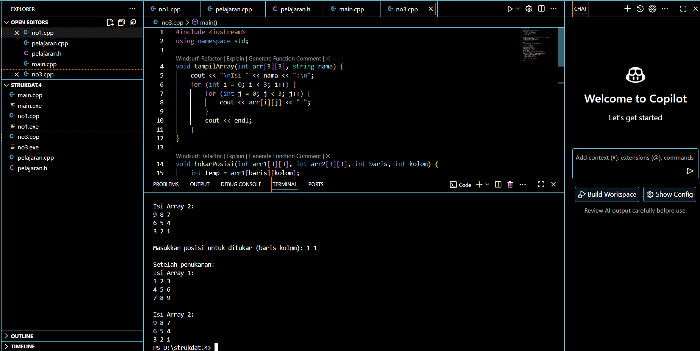

# <h1 align="center">Laporan Praktikum Modul 3 <br> ABSTRACT DATA TYPE (ADT) </h1>
<p align="center">RIZKI WIDODO - 103112400136 </p>

## Dasar Teori

Abstract Data Type (ADT) merupakan konsep dalam pemrograman yang mendefinisikan sebuah tipe data beserta sekumpulan operasi primitif yang dapat dilakukan pada tipe data tersebut, tanpa mengekspos detail implementasi internalnya. ADT berfokus pada "apa" yang dilakukan oleh operasi tersebut而不是 "bagaimana" cara melakukannya, sehingga memisahkan antara spesifikasi perilaku dengan implementasi nyata. Dalam implementasinya, ADT biasanya direalisasikan menjadi dua modul utama: file header (.h) yang berisi deklarasi tipe data dan prototipe fungsi/prosedur, serta file implementasi (.cpp) yang berisi kode detail dari setiap operasi primitif. Konsep ini memungkinkan pengguna untuk berinteraksi dengan tipe data hanya melalui antarmuka yang telah ditentukan, meningkatkan modularitas, abstraksi, dan kemudahan maintenance dalam pengembangan perangkat lunak.


## Guided

## Menghitung Rata Rata

## mahasiswa.h
```go
#ifndef MAHASISWA_H_INCLUDED
#define MAHASISWA_H_INCLUDED

struct mahasiswa
{
    char nim[10];
    int nilai1, nilai2;
};

void inputMhs(mahasiswa &m);
float rata2(mahasiswa m);

#endif
```

## Mahasiswa.cpp
```go
#include "mahasiswa.h"
#include <iostream>
using namespace std;

void inputMhs(mahasiswa &m)
{
    cout << "input nama = ";
    cin >> (m) .nim;
    cout << "input nilai = ";
    cin >> (m) .nilai1;
    cout << "input niali2 = ";
    cin >> m .nilai2;

}
float rata2(mahasiswa m)
{
    return float(m.nilai1 + m.nilai2) / 2;
}
```

## main.cpp
```go
#include <iostream>
#include "mahasiswa.h"
using namespace std;

int main(){
    mahasiswa mhs;
    inputMhs(mhs);
    cout << "rata rata = " << rata2(mhs);
    return 0;
}
```


### Soal 1

Buat program yang dapat menyimpan data mahasiswa (max. 10) ke dalam sebuah array
dengan field nama, nim, uts, uas, tugas, dan nilai akhir. Nilai akhir diperoleh dari FUNGSI 
dengan rumus 0.3*uts+0.4*uas+0.3*tugas.

```go
#include <iostream>
#include <string>
using namespace std;

struct Mahasiswa {
    string nama;
    string nim;
    float uts;
    float uas;
    float tugas;
    float nilaiAkhir;
};

float hitungNilaiAkhir(float uts, float uas, float tugas) {
    return 0.3*uts + 0.4*uas + 0.3*tugas;
}

int main() {
    Mahasiswa data[10];
    int jumlah = 0;
    int pilihan;
    
    do {
        cout << "\nMenu Data Mahasiswa";
        cout << "\n1. Tambah Data";
        cout << "\n2. Tampilkan Data";
        cout << "\n3. Keluar";
        cout << "\nPilihan: ";
        cin >> pilihan;
        
        if (pilihan == 1) {
            if (jumlah < 10) {
                cout << "\nNama: ";
                cin.ignore();
                getline(cin, data[jumlah].nama);
                cout << "NIM: ";
                getline(cin, data[jumlah].nim);
                cout << "UTS: ";
                cin >> data[jumlah].uts;
                cout << "UAS: ";
                cin >> data[jumlah].uas;
                cout << "Tugas: ";
                cin >> data[jumlah].tugas;
                
                data[jumlah].nilaiAkhir = hitungNilaiAkhir(
                    data[jumlah].uts, data[jumlah].uas, data[jumlah].tugas);
                
                jumlah++;
                cout << "Data berhasil ditambahkan!\n";
            } else {
                cout << "Data sudah penuh!\n";
            }
        } else if (pilihan == 2) {
            cout << "\nData Mahasiswa:\n";
            for (int i = 0; i < jumlah; i++) {
                cout << i+1 << ". " << data[i].nama << " (" << data[i].nim 
                     << ") - Nilai Akhir: " << data[i].nilaiAkhir << endl;
            }
        }
    } while (pilihan != 3);
    
    return 0;
}

```
> Output
> 

penjelasan kode

Program ini menggunakan struct Mahasiswa untuk menyimpan data lengkap mahasiswa termasuk nama, NIM, nilai UTS, UAS, tugas, dan nilai akhir. Data disimpan dalam array berkapasitas maksimal 10 elemen, dengan fungsi hitungNilaiAkhir() yang menerapkan rumus 30% UTS + 40% UAS + 30% tugas untuk menghitung nilai akhir secara otomatis. Program dilengkapi dengan menu interaktif yang memungkinkan pengguna menambah data hingga kapasitas penuh dan menampilkan semua data yang telah dimasukkan beserta perhitungan nilai akhirnya.


Modul 3 ABSTRACT DATA TYPE (ADT)/Output/Soalno2.jpg
### Soal 2

> 


### pelajaran.cpp
```go
#include <iostream>
#include "pelajaran.h"

pelajaran create_pelajaran(string namapel, string kodepel) {
    pelajaran p;
    p.namakapel = namapel;
    p.kodewapel = kodepel;
    return p;
}

void tampli_pelajaran(pelajaran pel) {
    cout << "name pelajaran : " << pel.namakapel << endl;
    cout << "nilai : " << pel.kodewapel << endl;
}
```
### pelajaran.h
```go
#ifndef PELAJARAN_H
#define PELAJARAN_H

#include <string>
using namespace std;

struct pelajaran {
    string namakapel;
    string kodewapel;
};

pelajaran create_pelajaran(string namapel, string kodepel);
void tampli_pelajaran(pelajaran pel);

#endif
```

### main.cpp
```go
#include <iostream>
#include "pelajaran.h"
using namespace std;

int main() {
    string namapel = "$truktur Data";
    string kodepel = "$TD";
    pelajaran pel = create_pelajaran(namapel, kodepel);
    tampli_pelajaran(pel);
    return 0;
}
```
> Output
> 

penjelasan kode

Implementasi ADT Pelajaran menerapkan konsep abstract data type dengan memisahkan deklarasi dan implementasi ke dalam file terpisah. File pelajaran.h berisi definisi struct pelajaran dengan field namakapel dan kodewapel beserta deklarasi fungsi create_pelajaran() sebagai konstruktor dan tampli_pelajaran() sebagai prosedur tampil. File pelajaran.cpp mengimplementasikan fungsi-fungsi tersebut, dimana create_pelajaran() membuat objek pelajaran baru dengan parameter yang diberikan, sedangkan tampli_pelajaran() menampilkan data sesuai format output yang diminta. File main.cpp digunakan sebagai driver program untuk menguji fungsionalitas ADT yang telah dibuat.


### Soal 3

Buatlah program dengan ketentuan :
- 2 buah array 2D integer berukuran 3x3 dan 2 buah pointer integer
- fungsi/prosedur yang menampilkan isi sebuah array integer 2D
- fungsi/prosedur yang akan menukarkan isi dari 2 array integer 2D pada posisi tertentu

STRUKTUR DATA 35
- fungsi/prosedur yang akan menukarkan isi dari variabel yang ditunjuk oleh 2 buah
pointer

```go
#include <iostream>
using namespace std;

void tampilArray(int arr[3][3], string nama) {
    cout << "\nIsi " << nama << ":\n";
    for (int i = 0; i < 3; i++) {
        for (int j = 0; j < 3; j++) {
            cout << arr[i][j] << " ";
        }
        cout << endl;
    }
}

void tukarPosisi(int arr1[3][3], int arr2[3][3], int baris, int kolom) {
    int temp = arr1[baris][kolom];
    arr1[baris][kolom] = arr2[baris][kolom];
    arr2[baris][kolom] = temp;
}

int main() {
    int array1[3][3] = {{1,2,3}, {4,5,6}, {7,8,9}};
    int array2[3][3] = {{9,8,7}, {6,5,4}, {3,2,1}};
    
    int *ptr1 = &array1[0][0];
    int *ptr2 = &array2[0][0];
    
    cout << "Sebelum penukaran:";
    tampilArray(array1, "Array 1");
    tampilArray(array2, "Array 2");
    
    int baris, kolom;
    cout << "\nMasukkan posisi untuk ditukar (baris kolom): ";
    cin >> baris >> kolom;
    
    if (baris >= 0 && baris < 3 && kolom >= 0 && kolom < 3) {
        tukarPosisi(array1, array2, baris, kolom);
        cout << "\nSetelah penukaran:";
        tampilArray(array1, "Array 1");
        tampilArray(array2, "Array 2");
    } else {
        cout << "Posisi tidak valid!\n";
    }
    
    return 0;
}
```
> Output
> 


penjelasan kode

Program ini mendemonstrasikan manipulasi array dua dimensi 3x3 menggunakan pointer integer. Dua array disiapkan dengan nilai yang berbeda, kemudian program menyediakan fungsi tampilArray() untuk menampilkan isi array dan fungsi tukarPosisi() untuk menukar nilai pada posisi tertentu antara kedua array. Program menggunakan pointer yang menunjuk ke elemen pertama masing-masing array dan memvalidasi input posisi yang dimasukkan pengguna untuk memastikan berada dalam rentang indeks yang valid sebelum melakukan operasi penukaran nilai.

## Referensi
1. https://www.w3schools.com/cpp/cpp_references.asp
2. https://www.w3schools.com/cpp/cpp_function_reference.asp
3. https://www.w3schools.com/cpp/cpp_function_structures.asp
4. https://www.w3schools.com/cpp/exercise.asp?x=xrcise_function_reference1
5. https://www.w3schools.com/cpp/cpp_function_param.asp
