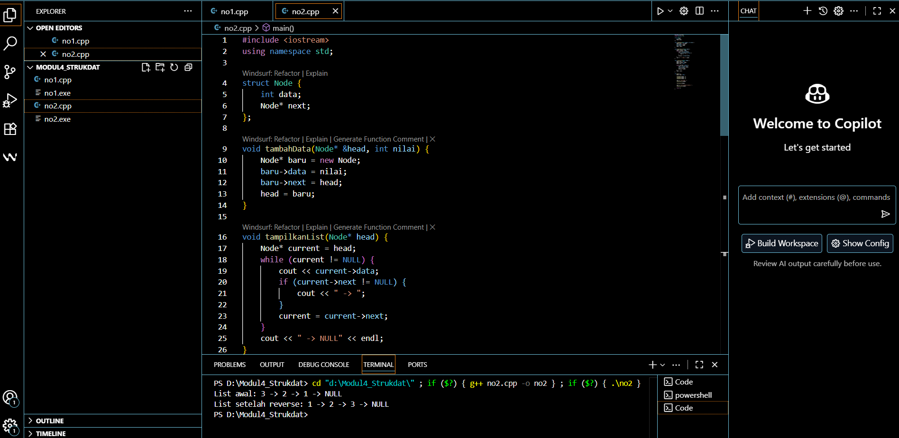

# <h1 align="center">Laporan Praktikum Modul 4 <br> SINGLY LINKED LIST (BAGIAN PERTAMA) </h1>
<p align="center">RIZKI WIDODO - 103112400136 </p>

## Dasar Teori
Singly Linked List merupakan struktur data dinamis yang terdiri dari serangkaian elemen (node) yang saling terhubung melalui pointer, dimana setiap elemen mengandung dua bagian utama: data (info) dan pointer penunjuk ke elemen berikutnya (next). Struktur ini diawali dengan pointer first yang menunjuk ke elemen pertama, dan diakhiri dengan pointer NULL pada elemen terakhir, memungkinkan operasi penyisipan (insert), penghapusan (delete), dan penelusuran (traversal) data secara efisien. Keunggulan utamanya adalah fleksibilitas dalam manajemen memori karena dapat tumbuh dan menyusut sesuai kebutuhan, serta kemudahan dalam melakukan modifikasi data tanpa perlu menggeser elemen lain seperti pada array statis. Implementasinya dalam C++ menggunakan struct untuk mendefinisikan node, pointer untuk menghubungkan node, serta fungsi-fungsi primitif seperti alokasi(), dealokasi(), insertFirst(), dan deleteFirst() untuk mengelola operasi dasar pada list.


## Guided
```go
#include <iostream>
using namespace std;

// Struktur Node
struct Node {
    int data;
    Node* next;
};

// Pointer awal dan akhir
Node* head = nullptr;

// Fungsi untuk membuat node baru
Node* createNode(int data) {
    Node* newNode = new Node();
    newNode->data = data;
    newNode->next = nullptr;
    return newNode;
}


void insertBelakang(int data) {
    Node* newNode = createNode(data);
    if (head == nullptr) {
        head = newNode;
    } else {
        Node* temp = head;
        while (temp->next != nullptr) {
            temp = temp->next;
        }
        temp->next = newNode;
    }
    cout << "Data " << data << " berhasil ditambahkan di belakang.\n";
}

void insertSetelah(int target, int dataBaru) {
    Node* temp = head;
    while (temp != nullptr && temp->data != target) {
        temp = temp->next;
    }

    if (temp == nullptr) {
        cout << "Data " << target << " tidak ditemukan!\n";
    } else {
        Node* newNode = createNode(dataBaru);
        newNode->next = temp->next;
        temp->next = newNode;
        cout << "Data " << dataBaru << " berhasil disisipkan setelah " << target << ".\n";
    }
}

// ========== DELETE FUNCTION ==========
void hapusNode(int data) {
    if (head == nullptr) {
        cout << "List kosong!\n";
        return;
    }

    Node* temp = head;
    Node* prev = nullptr;

    // Jika data di node pertama
    if (temp != nullptr && temp->data == data) {
        head = temp->next;
        delete temp;
        cout << "Data " << data << " berhasil dihapus.\n";
        return;
    }

    // Cari node yang akan dihapus
    while (temp != nullptr && temp->data != data) {
        prev = temp;
        temp = temp->next;
    }

    // Jika data tidak ditemukan
    if (temp == nullptr) {
        cout << "Data " << data << " tidak ditemukan!\n";
        return;
    }

    prev->next = temp->next;
    delete temp;
    cout << "Data " << data << " berhasil dihapus.\n";
}

// ========== UPDATE FUNCTION ==========
void updateNode(int dataLama, int dataBaru) {
    Node* temp = head;
    while (temp != nullptr && temp->data != dataLama) {
        temp = temp->next;
    }

    if (temp == nullptr) {
        cout << "Data " << dataLama << " tidak ditemukan!\n";
    } else {
        temp->data = dataBaru;
        cout << "Data " << dataLama << " berhasil diupdate menjadi " << dataBaru << ".\n";
    }
}

// ========== DISPLAY FUNCTION ==========
void tampilkanList() {
    if (head == nullptr) {
        cout << "List kosong!\n";
        return;
    }

    Node* temp = head;
    cout << "Isi Linked List: ";
    while (temp != nullptr) {
        cout << temp->data << " -> ";
        temp = temp->next
    }
    cout << "NULL\n";
}

// ========== MAIN PROGRAM ==========
int main() {
    int pilihan, data, target, dataBaru;

    do {
        cout << "\n=== MENU SINGLE LINKED LIST ===\n";
        cout << "1. Insert Depan\n";
        cout << "2. Insert Belakang\n";
        cout << "3. Insert Setelah\n";
        cout << "4. Hapus Data\n";
        cout << "5. Update Data\n";
        cout << "6. Tampilkan List\n";
        cout << "0. Keluar\n";
        cout << "Pilih: ";
        cin >> pilihan;

        switch (pilihan) {
            case 1:
                cout << "Masukkan data: ";
                cin >> data;
                insertDepan(data);
                break;
            case 2:
                cout << "Masukkan data: ";
                cin >> data;
                insertBelakang(data);
                break;
            case 3:
                cout << "Masukkan data target: ";
                cin >> target;
                cout << "Masukkan data baru: ";
                cin >> dataBaru;
                insertSetelah(target, dataBaru);
                break;
            case 4:
                cout << "Masukkan data yang ingin dihapus: ";
                cin >> data;
                hapusNode(data);
                break;
            case 5:
                cout << "Masukkan data lama: ";
                cin >> data;
                cout << "Masukkan data baru: ";
                cin >> dataBaru;
                updateNode(data, dataBaru);
                break;
            case 6:
                tampilkanList();
                break;
            case 0:
                cout << "Program selesai.\n";
                break;
            default:
                cout << "Pilihan tidak valid!\n";
        }
    } while (pilihan != 0);

    return 0;
}
```

### Soal 1

buatlah single linked list untuk Antrian yang menyimpan data pembeli( nama dan pesanan). program memiliki beberapa menu seperti tambah antrian,  layani antrian(hapus), dan tampilkan antrian. \*antrian pertama harus yang pertama dilayani


```go
#include <iostream>
#include <string>
using namespace std;

// Definisi struct
struct Mahasiswa {
    string nama;
    string nim;
    float ipk;
};

int main() {

    Mahasiswa mhs1;

    cout << "Masukkan Nama Mahasiswa: ";
    getline(cin, mhs1.nama);
    // cin >> mhs1.nama;
    cout << "Masukkan NIM Mahasiswa : ";
    cin >> mhs1.nim;
    cout << "Masukkan IPK Mahasiswa : ";
    cin >> mhs1.ipk;

    cout << "\n=== Data Mahasiswa ===" << endl;
    cout << "Nama : " << mhs1.nama << endl;
    cout << "NIM  : " << mhs1.nim << endl;
    cout << "IPK  : " << mhs1.ipk << endl;

    return 0;
}

```
> Output
> 

penjelasan kode

Antrian Pembeli menggunakan struktur data queue yang diimplementasikan dengan singly linked list untuk menyimpan data pembeli berupa nama dan pesanan, dimana program memiliki fungsi tambahAntrian untuk menambahkan node baru di akhir list, layaniAntrian untuk menghapus node di depan list sesuai prinsip FIFO (First-In-First-Out), dan tampilkanAntrian untuk menelusuri seluruh node dari depan ke belakang, dengan menggunakan dua pointer front dan rear untuk efisiensi operasi.


### Soal 2

buatlah program kode untuk membalik (reverse) singly linked list (1-2-3 menjadi 3-2-1)

   
```go
#include <iostream>
using namespace std;

struct Node {
    int data;
    Node* next;
};

void tambahData(Node* &head, int nilai) {
    Node* baru = new Node;
    baru->data = nilai;
    baru->next = head;
    head = baru;
}

void tampilkanList(Node* head) {
    Node* current = head;
    while (current != NULL) {
        cout << current->data;
        if (current->next != NULL) {
            cout << " -> ";
        }
        current = current->next;
    }
    cout << " -> NULL" << endl;
}

void reverseList(Node* &head) {
    Node* prev = NULL;
    Node* current = head;
    Node* next = NULL;
    
    while (current != NULL) {
        next = current->next;
        current->next = prev;
        prev = current;
        current = next;
    }
    head = prev;
}

int main() {
    Node* head = NULL;
    
    tambahData(head, 1);
    tambahData(head, 2);
    tambahData(head, 3);
    
    cout << "List awal: ";
    tampilkanList(head);
    
    reverseList(head);
    
    cout << "List setelah reverse: ";
    tampilkanList(head);
    
    return 0;
}
```

> Output
> 

penjelasan kode

Reverse Linked List demonstrasi algoritma untuk membalik urutan node dalam singly linked list dengan menggunakan tiga pointer (prev, current, next) yang bekerja secara iteratif mengubah arah pointer setiap node sehingga urutan 1→2→3→NULL menjadi 3→2→1→NULL, dimana teknik ini mempertahankan data asli namun mengubah hubungan pointer antar node tanpa menggunakan memori tambahan.


## Referensi
https://www.w3schools.com/cpp/cpp_structs.asp  
https://www.w3schools.com/cpp/cpp_pointers.asp  
https://www.w3schools.com/cpp/cpp_linkedlist.asp  
https://www.w3schools.com/cpp/cpp_while_loop.asp  
https://www.w3schools.com/cpp/cpp_queue.asp
