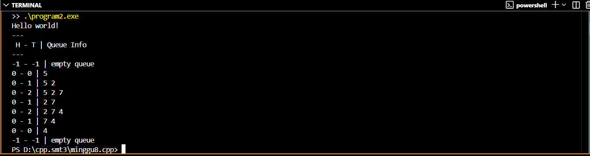

# <h1 align="center">Laporan Praktikum Modul 8 <br>QUEUE</h1>
<p align="center">RIZKI WIDODO - 103112400136</p>

## Dasar Teori
Queue adalah struktur data yang bersifat FIFO (First In First Out), di mana elemen yang pertama 
kali dimasukkan akan menjadi elemen yang pertama kali dikeluarkan, layaknya antrean. 
Implementasinya dapat dilakukan menggunakan linked list, dengan operasi enqueue (penyisipan)
pada tail dan dequeue (penghapusan) pada head. Selain itu, queue juga dapat direalisasikan 
menggunakan array dengan tiga pendekatan umum: pendekatan pertama dengan head statis dan
tail yang bergerak maju, pendekatan kedua di mana baik head maupun tail dapat bergerak, serta 
pendekatan ketiga yang menerapkan konsep circular buffer sehingga head dan tail dapat berputar
pada indeks array untuk mengoptimalkan penggunaan ruang memori.

## Guided

### Guided 1
```c++
#include <iostream>
using namespace std;

#define MAX 5 // ukuran maksimal queue

// Struktur Queue
struct Queue {
    int data[MAX];
    int head;
    int tail;
};

// Membuat antrean kosong
void createQueue(Queue &Q) {
    Q.head = -1;
    Q.tail = -1;
}

bool isEmpty(Queue Q) {
    return (Q.head == -1 && Q.tail == -1);
}

bool isFull(Queue Q) {
    return (Q.tail == MAX - 1);
}

// Menampilkan isi antrian
void printQueue(Queue Q) {
    if (isEmpty(Q)) {
        cout << "Queue kosong!" << endl;
    } else {
        cout << "Queue : ";
        for (int i = Q.head; i <= Q.tail; i++) {
            cout << Q.data[i] << " ";
        }
        cout << endl;
    }
}

void enqueue(Queue &Q, int x) {
    if (isFull(Q)) {
        cout << "Queue penuh! Tidak bisa menambah data." << endl;
    } else {
        if (isEmpty(Q)) {
            Q.head = Q.tail = 0;
        } else {
            Q.tail++;
        }
        Q.data[Q.tail] = x;
        cout << "Enqueue: " << x << endl;
    }
}

void dequeue(Queue &Q) {
    if (isEmpty(Q)) {
        cout << "Queue kosong! Tidak ada data yang dihapus." << endl;
    } else {
        cout << "Dequeue: " << Q.data[Q.head] << endl;
        // Jika hanya 1 elemen
        if (Q.head == Q.tail) {
            Q.head = Q.tail = -1;
        } else {
            // Geser semua elemen ke kiri
            for (int i = Q.head; i < Q.tail; i++) {
                Q.data[i] = Q.data[i + 1];
            }
            Q.tail--;
        }
    }
}

int main() {
    Queue Q;
    enqueue(Q, 5);
    enqueue(Q, 2);
    enqueue(Q, 7);
    printQueue(Q);

    dequeue(Q);
    printQueue(Q);

    enqueue(Q, 4);
    enqueue(Q, 9);
    printQueue(Q);

    dequeue(Q);
    dequeue(Q);
    printQueue(Q);

    return 0;
}
```

> Output
> 
> 

Program guided1.cpp mengimplementasikan antrian (queue) FIFO dengan array statis 5 elemen. Program memiliki fungsi enqueue untuk menambah data di belakang dan dequeue untuk menghapus data di depan dengan menggeser elemen. Dilengkapi dengan penanda head dan tail, program ini mendemonstrasikan operasi dasar antrian beserta pengecekan kondisi penuh atau kosong.

## UNGUIDED

### Soal 1
Buatlah implementasi ADT Queue pada file “queue.cpp” dengan menerapkan mekanisme
queue Alternatif 1 (head diam, tail bergerak).

#### queue.h
```c++
#ifndef QUEUE_H
#define QUEUE_H

typedef int infotype;
const int NMax = 5; // ukuran maksimum queue

struct Queue {
    infotype info[NMax];
    int head;
    int tail;
};

void createQueue(Queue &Q);
bool isEmptyQueue(Queue Q);
bool isFullQueue(Queue Q);
void enqueue(Queue &Q, infotype x);
infotype dequeue(Queue &Q);
void printInfo(Queue Q);

#endif
```
#### queue.cpp
```c++
#include <iostream>
#include "queue.h"
using namespace std;

void createQueue(Queue &Q) {
    Q.head = -1;
    Q.tail = -1;
}

bool isEmptyQueue(Queue Q) {
    return (Q.head == -1 && Q.tail == -1);
}

bool isFullQueue(Queue Q) {
    return (Q.tail == NMax - 1);
}

void enqueue(Queue &Q, infotype x) {
    if (isFullQueue(Q)) {
        cout << "Queue penuh, tidak bisa enqueue " << x << endl;
        return;
    }
    if (isEmptyQueue(Q)) {
        Q.head = 0;
        Q.tail = 0;
    } else {
        Q.tail++;
    }
    Q.info[Q.tail] = x;
}

infotype dequeue(Queue &Q) {
    infotype x;
    if (isEmptyQueue(Q)) {
        cout << "Queue kosong, tidak bisa dequeue" << endl;
        return -1; // nilai default jika kosong
    }
    x = Q.info[Q.head];
    if (Q.head == Q.tail) {
        // hanya satu elemen
        Q.head = -1;
        Q.tail = -1;
    } else {
        // geser semua elemen ke kiri
        for (int i = Q.head + 1; i <= Q.tail; i++) {
            Q.info[i - 1] = Q.info[i];
        }
        Q.tail--;
    }
    return x;
}

void printInfo(Queue Q) {
    if (isEmptyQueue(Q)) {
        cout << Q.head << " - " << Q.tail << " | empty queue" << endl;
    } else {
        cout << Q.head << " - " << Q.tail << " | ";
        for (int i = Q.head; i <= Q.tail; i++) {
            cout << Q.info[i] << " ";
        }
        cout << endl;
    }
}
```
#### main.cpp
```c++
#include <iostream>
#include "queue.h"
using namespace std;

int main() {
    cout << "Hello World" << endl;
    Queue Q;
    createQueue(Q);
    cout << "---" << endl;
    cout << " H - T \t | Queue info" << endl;
    cout << "---" << endl;
    printInfo(Q);
    enqueue(Q, 5); printInfo(Q);
    enqueue(Q, 2); printInfo(Q);
    enqueue(Q, 7); printInfo(Q);
    dequeue(Q); printInfo(Q);
    enqueue(Q, 4); printInfo(Q);
    dequeue(Q); printInfo(Q);
    dequeue(Q); printInfo(Q);
    return 0;
}
```
> Output soal 1
> 
> 

Program ini buat antrian pakai cara pertama di modul. Awalnya head dan tail di -1 kalau antrian kosong. Pas masukin elemen pertama, head berubah jadi 0 dan tail juga jadi 0. Head bakal tetap di 0 selama masih ada isi antrian.
Setiap kali nambah data, tail yang gerak maju. Kalau ngambil data dari depan, head tetap di 0, tapi semua data di belakangnya digeser ke depan satu per satu, jadi tail otomatis mundur. Kalau setelah ngambil data ternyata antrian jadi kosong, head dan tail balik lagi ke -1.
Cara ini mirip kayak antrian nyata di loket, tapi kurang efisien karena setiap kali ngambil data dari depan, semua data harus digeser.

### Soal 2
Buatlah implementasi ADT Queue pada file “queue.cpp” dengan menerapkan mekanisme
queue Alternatif 2 (head bergerak, tail bergerak).

#### queue.cpp
```c++
#include <iostream>
#include "queue.h"
using namespace std;

void createQueue(Queue &Q) {
    Q.head = -1;
    Q.tail = -1;
}

bool isEmptyQueue(Queue Q) {
    return (Q.head == -1 && Q.tail == -1);
}

bool isFullQueue(Queue Q) {
    return (Q.tail == NMax - 1);
}

void enqueue(Queue &Q, infotype x) {
    if (isFullQueue(Q)) return;
    if (isEmptyQueue(Q)) {
        Q.head = 0;
        Q.tail = 0;
    } else {
        Q.tail++;
    }
    Q.info[Q.tail] = x;
}

infotype dequeue(Queue &Q) {
    if (isEmptyQueue(Q)) return -1;
    infotype x = Q.info[Q.head];
    
    if (Q.head == Q.tail) {
        Q.head = -1;
        Q.tail = -1;
    } else {
        Q.head++;
    }
    
    return x;
}

void printInfo(Queue Q) {
    if (isEmptyQueue(Q)) {
        cout << Q.head << " - " << Q.tail << " | empty queue" << endl;
    } else {
        cout << Q.head << " - " << Q.tail << " | ";
        for (int i = Q.head; i <= Q.tail; i++) {
            cout << Q.info[i] << " ";
        }
        cout << endl;
    }
}
```

> Output soal 2
> 
> 

"Program ini mengimplementasikan antrian dimana baik head maupun tail dapat bergerak. Saat dequeue, head bergerak maju ke elemen berikutnya tanpa melakukan pergeseran data, sehingga lebih efisien. Namun dalam skenario tertentu, metode ini dapat menyebabkan 'penuh semu' dimana tail mencapai akhir array meskipun masih terdapat ruang kosong di depannya akibat pergerakan head."

### Soal 3
Buatlah implementasi ADT Queue pada file “queue.cpp” dengan menerapkan mekanisme
queue Alternatif 3 (head dan tail berputar).

#### queue.cpp
```c++
#include <iostream>
#include "queue.h"
using namespace std;

void createQueue(Queue &Q) {
    Q.head = -1;
    Q.tail = -1;
}

bool isEmptyQueue(Queue Q) {
    return (Q.head == -1 && Q.tail == -1);
}

bool isFullQueue(Queue Q) {
    return ((Q.tail + 1) % NMax == Q.head);
}

void enqueue(Queue &Q, infotype x) {
    if (isFullQueue(Q)) {
        cout << "Queue penuh!" << endl;
        return;
    }
    
    if (isEmptyQueue(Q)) {
        Q.head = 0;
        Q.tail = 0;
    } else {
        Q.tail = (Q.tail + 1) % NMax;
    }
    Q.info[Q.tail] = x;
}

infotype dequeue(Queue &Q) {
    if (isEmptyQueue(Q)) {
        cout << "Queue kosong!" << endl;
        return -1;
    }
    
    infotype x = Q.info[Q.head];
    
    if (Q.head == Q.tail) {
        Q.head = -1;
        Q.tail = -1;
    } else {
        Q.head = (Q.head + 1) % NMax;
    }
    
    return x;
}

void printInfo(Queue Q) {
    if (isEmptyQueue(Q)) {
        cout << Q.head << " - " << Q.tail << " | empty queue" << endl;
    } else {
        cout << Q.head << " - " << Q.tail << " | ";
        
        int i = Q.head;
        while (true) {
            cout << Q.info[i] << " ";
            if (i == Q.tail) break;
            i = (i + 1) % NMax;
        }
        cout << endl;
    }
}
```

> Output soal 3
> 
> 
> 
Program ini mengimplementasikan antrian circular sesuai modul Alternatif 3 dimana head dan tail berputar mengelilingi indeks array menggunakan operasi modulus, sehingga ketika mencapai batas NMax-1 akan kembali ke indeks 0, mengatasi masalah "penuh semu" dan mengoptimalkan penggunaan seluruh kapasitas array 5 elemen tanpa perlu pergeseran data, persis seperti konsep circular buffer yang dijelaskan dalam modul.

## Referensi

1. https://www.geeksforgeeks.org/queue-cpp-stl/ (diakses 18 November 2024)
2. https://www.programiz.com/dsa/queue (diakses 18 November 2024)
3. https://www.javatpoint.com/circular-queue (diakses 18 November 2024)
