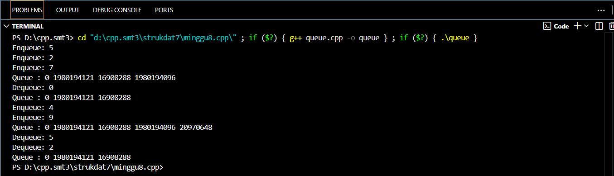

# <h1 align="center">Laporan Praktikum Modul 8 <br>QUEUE</h1>
<p align="center">RIZKI WIDODO - 103112400136</p>

## Dasar Teori
Queue adalah struktur data yang bersifat FIFO (First In First Out), di mana elemen yang pertama 
kali dimasukkan akan menjadi elemen yang pertama kali dikeluarkan, layaknya antrean. 
Implementasinya dapat dilakukan menggunakan linked list, dengan operasi enqueue (penyisipan)
pada tail dan dequeue (penghapusan) pada head. Selain itu, queue juga dapat direalisasikan 
menggunakan array dengan tiga pendekatan umum: pendekatan pertama dengan head statis dan
tail yang bergerak maju, pendekatan kedua di mana baik head maupun tail dapat bergerak, serta 
pendekatan ketiga yang menerapkan konsep circular buffer sehingga head dan tail dapat berputar
pada indeks array untuk mengoptimalkan penggunaan ruang memori.

## Guided

### Guided 1
```c++
#include <iostream>
using namespace std;

#define MAX 5 // ukuran maksimal queue

// Struktur Queue
struct Queue {
    int data[MAX];
    int head;
    int tail;
};

// Membuat antrean kosong
void createQueue(Queue &Q) {
    Q.head = -1;
    Q.tail = -1;
}

bool isEmpty(Queue Q) {
    return (Q.head == -1 && Q.tail == -1);
}

bool isFull(Queue Q) {
    return (Q.tail == MAX - 1);
}

// Menampilkan isi antrian
void printQueue(Queue Q) {
    if (isEmpty(Q)) {
        cout << "Queue kosong!" << endl;
    } else {
        cout << "Queue : ";
        for (int i = Q.head; i <= Q.tail; i++) {
            cout << Q.data[i] << " ";
        }
        cout << endl;
    }
}

void enqueue(Queue &Q, int x) {
    if (isFull(Q)) {
        cout << "Queue penuh! Tidak bisa menambah data." << endl;
    } else {
        if (isEmpty(Q)) {
            Q.head = Q.tail = 0;
        } else {
            Q.tail++;
        }
        Q.data[Q.tail] = x;
        cout << "Enqueue: " << x << endl;
    }
}

void dequeue(Queue &Q) {
    if (isEmpty(Q)) {
        cout << "Queue kosong! Tidak ada data yang dihapus." << endl;
    } else {
        cout << "Dequeue: " << Q.data[Q.head] << endl;
        // Jika hanya 1 elemen
        if (Q.head == Q.tail) {
            Q.head = Q.tail = -1;
        } else {
            // Geser semua elemen ke kiri
            for (int i = Q.head; i < Q.tail; i++) {
                Q.data[i] = Q.data[i + 1];
            }
            Q.tail--;
        }
    }
}

int main() {
    Queue Q;
    enqueue(Q, 5);
    enqueue(Q, 2);
    enqueue(Q, 7);
    printQueue(Q);

    dequeue(Q);
    printQueue(Q);

    enqueue(Q, 4);
    enqueue(Q, 9);
    printQueue(Q);

    dequeue(Q);
    dequeue(Q);
    printQueue(Q);

    return 0;
}
```

> Output
> 
> 

Program guided1.cpp mengimplementasikan antrian (queue) FIFO dengan array statis 5 elemen. Program memiliki fungsi enqueue untuk menambah data di belakang dan dequeue untuk menghapus data di depan dengan menggeser elemen. Dilengkapi dengan penanda head dan tail, program ini mendemonstrasikan operasi dasar antrian beserta pengecekan kondisi penuh atau kosong.

## UNGUIDED

### Soal 1
Buatlah implementasi ADT Queue pada file “queue.cpp” dengan menerapkan mekanisme
queue Alternatif 1 (head diam, tail bergerak).

#### queue.h
```c++
#ifndef QUEUE_H
#define QUEUE_H

typedef int infotype;
const int NMax = 5; // ukuran maksimum queue

struct Queue {
    infotype info[NMax];
    int head;
    int tail;
};

void createQueue(Queue &Q);
bool isEmptyQueue(Queue Q);
bool isFullQueue(Queue Q);
void enqueue(Queue &Q, infotype x);
infotype dequeue(Queue &Q);
void printInfo(Queue Q);

#endif
```
#### queue.cpp
```c++
#include <iostream>
#include "queue.h"
using namespace std;

void createQueue(Queue &Q) {
    Q.head = -1;
    Q.tail = -1;
}

bool isEmptyQueue(Queue Q) {
    return (Q.head == -1 && Q.tail == -1);
}

bool isFullQueue(Queue Q) {
    return (Q.tail == NMax - 1);
}

void enqueue(Queue &Q, infotype x) {
    if (isFullQueue(Q)) {
        cout << "Queue penuh, tidak bisa enqueue " << x << endl;
        return;
    }
    if (isEmptyQueue(Q)) {
        Q.head = 0;
        Q.tail = 0;
    } else {
        Q.tail++;
    }
    Q.info[Q.tail] = x;
}

infotype dequeue(Queue &Q) {
    infotype x;
    if (isEmptyQueue(Q)) {
        cout << "Queue kosong, tidak bisa dequeue" << endl;
        return -1; // nilai default jika kosong
    }
    x = Q.info[Q.head];
    if (Q.head == Q.tail) {
        // hanya satu elemen
        Q.head = -1;
        Q.tail = -1;
    } else {
        // geser semua elemen ke kiri
        for (int i = Q.head + 1; i <= Q.tail; i++) {
            Q.info[i - 1] = Q.info[i];
        }
        Q.tail--;
    }
    return x;
}

void printInfo(Queue Q) {
    if (isEmptyQueue(Q)) {
        cout << Q.head << " - " << Q.tail << " | empty queue" << endl;
    } else {
        cout << Q.head << " - " << Q.tail << " | ";
        for (int i = Q.head; i <= Q.tail; i++) {
            cout << Q.info[i] << " ";
        }
        cout << endl;
    }
}
```
#### main.cpp
```c++
#include <iostream>
#include "queue.h"
using namespace std;

int main() {
    cout << "Hello World" << endl;
    Queue Q;
    createQueue(Q);
    cout << "---" << endl;
    cout << " H - T \t | Queue info" << endl;
    cout << "---" << endl;
    printInfo(Q);
    enqueue(Q, 5); printInfo(Q);
    enqueue(Q, 2); printInfo(Q);
    enqueue(Q, 7); printInfo(Q);
    dequeue(Q); printInfo(Q);
    enqueue(Q, 4); printInfo(Q);
    dequeue(Q); printInfo(Q);
    dequeue(Q); printInfo(Q);
    return 0;
}
```
> Output soal 1
> 
> 

Program ini mengimplementasikan antrean di mana head selalu diam di indeks 0. Saat operasi enqueue, data ditambahkan ke posisi tail. Saat dequeue, data di indeks 0 diambil, dan semua elemen lain di belakangnya digeser secara fisik satu posisi ke depan . Akibatnya, tail ikut mundur. Metode ini tidak efisien karena operasi dequeue memerlukan pergeseran seluruh elemen.

### Soal 2
Buatlah implementasi ADT Queue pada file “queue.cpp” dengan menerapkan mekanisme
queue Alternatif 2 (head bergerak, tail bergerak).

#### queue.cpp
```c++
#include "queue.h"

QueueAlt2::QueueAlt2() {
    head = -1;
    tail = -1;
}

bool QueueAlt2::isEmptyQueue() {
    return (head == -1 && tail == -1);
}

bool QueueAlt2::isFullQueue() {
    return (tail == NMax - 1);
}

void QueueAlt2::enqueue(infotype x) {
    if (isFullQueue()) {
        cout << "Antrean Penuh" << endl;
    } else {
        if (isEmptyQueue()) {
            head = 0;
            tail = 0;
        } else {
            tail++;
        }
        info[tail] = x;
    }
}

void QueueAlt2::dequeue() {
    if (!isEmptyQueue()) {
        if (head == tail) {
            head = -1;
            tail = -1;
        } else {
            head++;
        }
    }
}

void QueueAlt2::printInfo() {
    if (isEmptyQueue()) {
        cout << head << " - " << tail << " | empty queue" << endl;

    } else {
        cout << head << " - " << tail << " | ";
        for (int i = head; i <= tail; i++) {
            cout << info[i];
            if (i < tail) {
                cout << " ";
            }
        }
        cout << endl;
    }
}
```

> Output soal 2
> 
> 

Program ini mengimplementasikan antrean yang lebih efisien dengan menggerakkan kedua penunjuk. Saat dequeue, tidak ada pergeseran elemen; sebaliknya, penunjuk head yang bergerak maju (head++). Meskipun dequeue menjadi cepat, metode ini dapat menyebabkan masalah "penuh semu", di mana antrean dianggap penuh karena tail telah mencapai akhir array, meskipun masih ada ruang kosong di bagian depan.

### Soal 3
Buatlah implementasi ADT Queue pada file “queue.cpp” dengan menerapkan mekanisme
queue Alternatif 3 (head dan tail berputar).

#### queue.cpp
```c++
#include "queue.h"

QueueAlt3::QueueAlt3() {
    head = -1;
    tail = -1;
}

bool QueueAlt3::isEmptyQueue() {
    return (head == -1 && tail == -1);
}

bool QueueAlt3::isFullQueue() {
    return ((tail + 1) % NMax == head);
}

void QueueAlt3::enqueue(infotype x) {
    if (isFullQueue()) {
        cout << "Antrean Penuh" << endl;
    } else {
        if (isEmptyQueue()) {
            head = 0;
            tail = 0;
        } else {
            tail = (tail + 1) % NMax;
        }
        info[tail] = x;
    }
}

void QueueAlt3::dequeue() {
    if (!isEmptyQueue()) {
        if (head == tail) {
            head = -1;
            tail = -1;
        } else {
            head = (head + 1) % NMax;
        }
    }
}

void QueueAlt3::printInfo() {
    if (isEmptyQueue()) {
        cout << head << " - " << tail << " | empty queue" << endl;
    } else {
        cout << head << " - " << tail << " | ";
        int i = head;
        while (true) {
            cout << info[i];
            if (i == tail) break;
            cout << " ";
            i = (i + 1) % NMax;
        }
        cout << endl;
    }
}
```

> Output soal 3
> 
> 
> 
Program ini mengimplementasikan antrean sebagai circular buffer, yang merupakan solusi optimal untuk masalah "penuh semu". Dengan menggunakan operasi modulus, head dan tail diperlakukan seolah-olah array "memutar". Jika tail atau head mencapai batas akhir, ia akan kembali ke indeks 0, memungkinkan ruang kosong di awal array untuk segera digunakan kembali .

## Referensi

1. https://www.geeksforgeeks.org/cpp/queue-cpp-stl/ (diakses pada 15 November 2025)
2. https://www.programiz.com/dsa/queue (diakses pada 15 November 2025)
3. https://www.tutorialspoint.com/basic-operations-for-queue-in-data-structure (diakses pada 15 November 2025)
