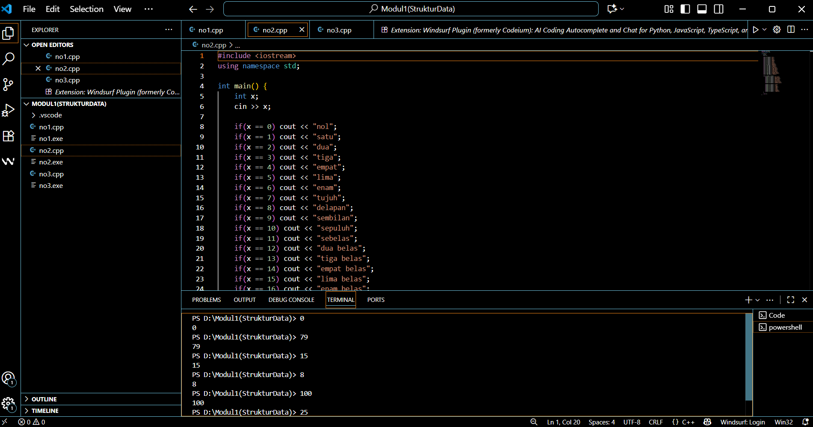
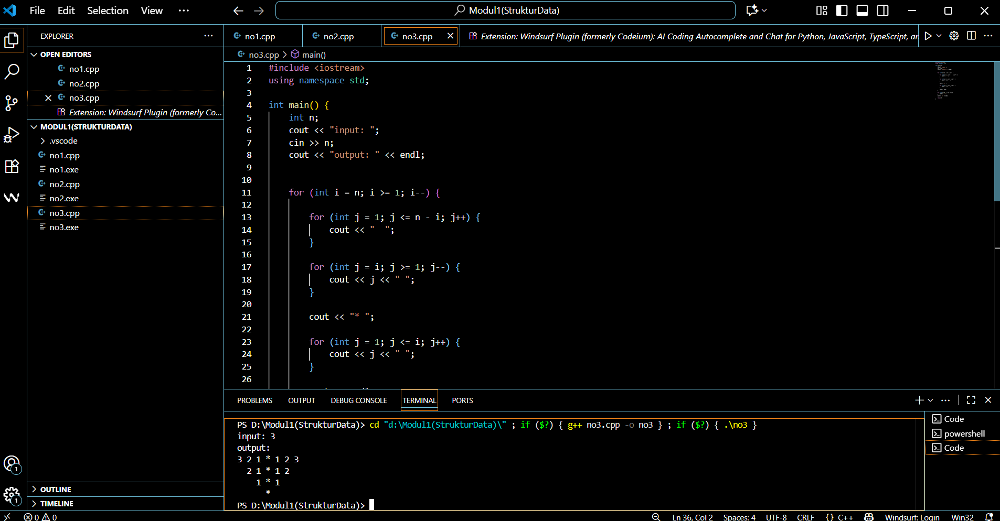

# <h1 align="center">Laporan Praktikum Modul 1 <br> Pengenalan C++ </h1>
<p align="center">RIZKI WIDODO - 103112400136 </p>

## Dasar Teori

yang panjang dikit

## Guided

### soal 1

aku mengerjakan perulangan

## Unguided

### Soal 1

Buatlah program yang menerima input-an dua buah bilangan betipe float, kemudian memberikan output-an hasil penjumlahan, pengurangan, perkalian, dan pembagian dari dua bilangan tersebut.


```go
#include <iostream>
using namespace std;

int main() {
    float a, b;
    
    cout << "Masukkan bilangan 1: ";
    cin >> a;
    cout << "Masukkan bilangan 2: ";
    cin >> b;
    
    cout << "\nHasil:" << endl;
    cout << a << " + " << b << " = " << a + b << endl;
    cout << a << " - " << b << " = " << a - b << endl;
    cout << a << " x " << b << " = " << a * b << endl;
    
    if(b != 0) {
        cout << a << " / " << b << " = " << a / b << endl;
    } else {
        cout << a << " / " << b << " = Error" << endl;
    }
    
    return 0;
}
```

> Output
> 
> %% Untuk mencantumkan screenshot, tidak boleh ada spasi di urlnya `()`, penamaan file bebas asal gak sara dan mudah dipahami aja,, dan jangan lupa hapus komen ini yah%%

Penjelasan ttg kode kalian disini

### Soal 2

Buatlah sebuah program yang menerima masukan angka dan mengeluarkan output nilai angka tersebut dalam bentuk tulisan. Angka yang akan di- input-kan user adalah bilangan bulat positif mulai dari 0 s.d 100


```go
#include <iostream>
using namespace std;

int main() {
    int x;
    cin >> x;
    
    if(x == 0) cout << "nol";
    if(x == 1) cout << "satu";
    if(x == 2) cout << "dua";
    if(x == 3) cout << "tiga";
    if(x == 4) cout << "empat";
    if(x == 5) cout << "lima";
    if(x == 6) cout << "enam";
    if(x == 7) cout << "tujuh";
    if(x == 8) cout << "delapan";
    if(x == 9) cout << "sembilan";
    if(x == 10) cout << "sepuluh";
    if(x == 11) cout << "sebelas";
    if(x == 12) cout << "dua belas";
    if(x == 13) cout << "tiga belas";
    if(x == 14) cout << "empat belas";
    if(x == 15) cout << "lima belas";
    if(x == 16) cout << "enam belas";
    if(x == 17) cout << "tujuh belas";
    if(x == 18) cout << "delapan belas";
    if(x == 19) cout << "sembilan belas";
    if(x == 100) cout << "seratus";
    
    if(x >= 20 && x <= 99) {
        if(x/10 == 2) cout << "dua puluh";
        if(x/10 == 3) cout << "tiga puluh";
        if(x/10 == 4) cout << "empat puluh";
        if(x/10 == 5) cout << "lima puluh";
        if(x/10 == 6) cout << "enam puluh";
        if(x/10 == 7) cout << "tujuh puluh";
        if(x/10 == 8) cout << "delapan puluh";
        if(x/10 == 9) cout << "sembilan puluh";
        
        if(x%10 == 1) cout << " satu";
        if(x%10 == 2) cout << " dua";
        if(x%10 == 3) cout << " tiga";
        if(x%10 == 4) cout << " empat";
        if(x%10 == 5) cout << " lima";
        if(x%10 == 6) cout << " enam";
        if(x%10 == 7) cout << " tujuh";
        if(x%10 == 8) cout << " delapan";
        if(x%10 == 9) cout << " sembilan";
    }
    
    return 0;
}
```
> Output
> 

penjelasan kode

Kalau adalanjutan di lanjut disini aja

soal nomor 3
Buatlah program yang dapat memberikan input dan output sbb.

```go
#include <iostream>
using namespace std;

int main() {
    int n;
    cout << "input: ";
    cin >> n;
    cout << "output: " << endl;
    
    
    for (int i = n; i >= 1; i--) {

        for (int j = 1; j <= n - i; j++) {
            cout << "  ";
        }        
        
        for (int j = i; j >= 1; j--) {
            cout << j << " ";
        }
        
        cout << "* ";

        for (int j = 1; j <= i; j++) {
            cout << j << " ";
        }
        
        cout << endl;
    }
    
    for (int i = 0; i < n; i++) {
        cout << "  ";
    }
    cout << "*" << endl;
    
    return 0;
}
```

> Output
> 

penjelasan bedanya sesuai soal

## Referensi

1. https://en.wikipedia.org/wiki/Data_structure (diakses blablabla)
