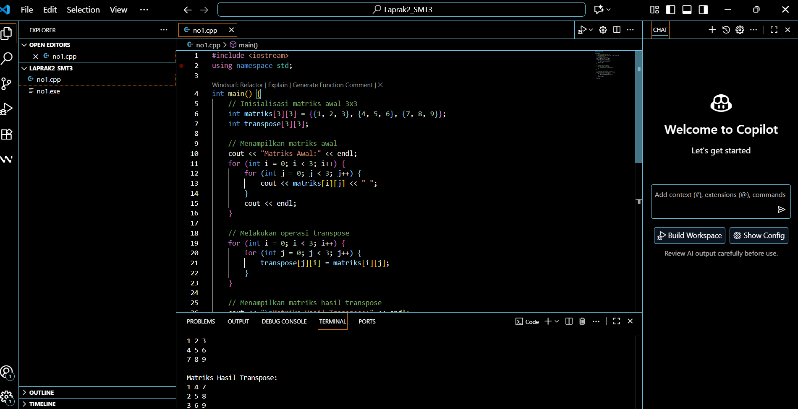
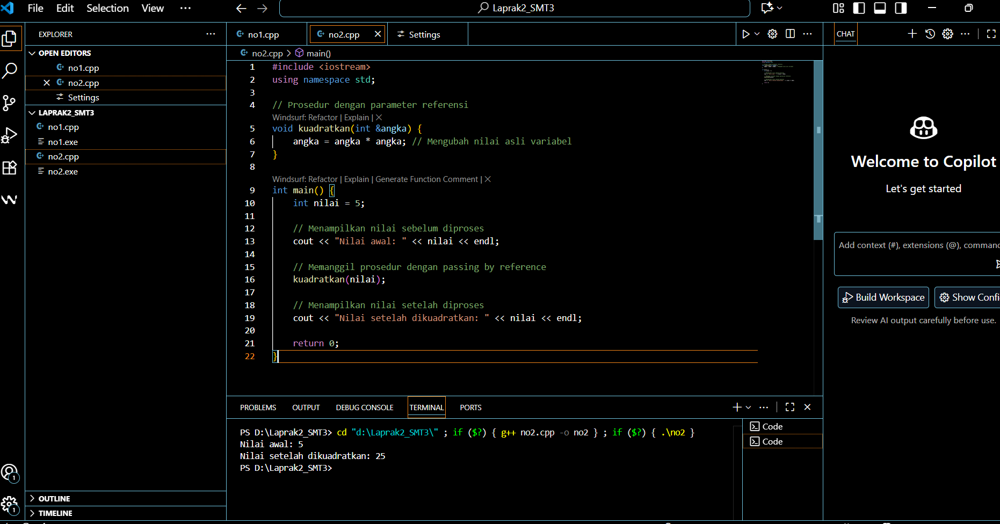

# <h1 align="center">Laporan Praktikum Modul 2 <br> Nama Modul</h1>
<p align="center">Rizki Widodo - 103112400136</p>

## Dasar Teori
Modul ini membahas konsep fundamental dalam pemrograman C++ meliputi array, pointer, fungsi, dan prosedur. Array berfungsi sebagai kumpulan data dengan tipe sama yang diakses melalui indeks, baik satu dimensi maupun multidimensi. Pointer merupakan variabel yang menyimpan alamat memori variabel lain, memungkinkan manipulasi data secara langsung di memori. Fungsi dan prosedur digunakan untuk memecah program menjadi modul-modul kecil, dimana fungsi mengembalikan nilai sedangkan prosedur (fungsi void) tidak. Terdapat tiga cara passing parameter: call by value (menyalin nilai), call by pointer (menggunakan alamat memori dengan operator), dan call by reference (menggunakan referensi dengan operator &) yang memungkinkan modifikasi variabel asli. Konsep-konsep ini menjadi pondasi penting untuk pengelolaan memori dan organisasi kode dalam pemrograman terstruktur.

## Unguided

### soal 1
1. Buatlah sebuah program untuk melakukan transpose pada sebuah matriks persegi berukuran 3x3. Operasi transpose adalah mengubah baris menjadi kolom dan sebaliknya. Inisialisasi matriks awal di dalam kode, kemudian buat logika untuk melakukan transpose dan simpan hasilnya ke dalam matriks baru. Terakhir, tampilkan matriks awal dan matriks hasil transpose.

Contoh Output:

Matriks Awal:
1 2 3
4 5 6
7 8 9

Matriks Hasil Transpose:
1 4 7
2 5 8
3 6 9

### Soal 1

```go
#include <iostream>
using namespace std;

int main() {
    // Inisialisasi matriks awal 3x3
    int matriks[3][3] = {{1, 2, 3}, {4, 5, 6}, {7, 8, 9}};
    int transpose[3][3];
    
    // Menampilkan matriks awal
    cout << "Matriks Awal:" << endl;
    for (int i = 0; i < 3; i++) {
        for (int j = 0; j < 3; j++) {
            cout << matriks[i][j] << " ";
        }
        cout << endl;
    }
    
    // Melakukan operasi transpose
    for (int i = 0; i < 3; i++) {
        for (int j = 0; j < 3; j++) {
            transpose[j][i] = matriks[i][j];
        }
    }
    
    // Menampilkan matriks hasil transpose
    cout << "\nMatriks Hasil Transpose:" << endl;
    for (int i = 0; i < 3; i++) {
        for (int j = 0; j < 3; j++) {
            cout << transpose[i][j] << " ";
        }
        cout << endl;
    }
    
    return 0;
}
```

> Output
> 
> %% Untuk mencantumkan screenshot, tidak boleh ada spasi di urlnya `()`, penamaan file bebas asal gak sara dan mudah dipahami aja,, dan jangan lupa hapus komen ini yah%%

Penjelasan ttg kode kalian disini
Program ini membuat matriks 3x3 dengan nilai 1-9, kemudian membuat matriks transpose dengan menukar baris dan kolom menggunakan loop bersarang. Kunci transposenya ada di line transpose[j][i] = matriks[i][j] dimana indeks i dan j ditukar, sehingga elemen di baris i kolom j pindah ke baris j kolom i. Hasilnya matriks awal yang barisnya 1-2-3, 4-5-6, 7-8-9 berubah menjadi kolomnya 1-4-7, 2-5-8, 3-6-9.


### Soal 2
2. Buatlah program yang menunjukkan penggunaan call by reference. Buat sebuah prosedur bernama kuadratkan yang menerima satu parameter integer secara referensi (&). Prosedur ini akan mengubah nilai asli variabel yang dilewatkan dengan nilai kuadratnya. Tampilkan nilai variabel di main() sebelum dan sesudah memanggil prosedur untuk membuktikan perubahannya. 

Contoh Output:

Nilai awal: 5
Nilai setelah dikuadratkan: 25
soal nomor 2A

```go
#include <iostream>
using namespace std;

// Prosedur dengan parameter referensi
void kuadratkan(int &angka) {
    angka = angka * angka; // Mengubah nilai asli variabel
}


int main() {
    int nilai = 5;
    
    // Menampilkan nilai sebelum diproses
    cout << "Nilai awal: " << nilai << endl;
    
    // Memanggil prosedur dengan passing by reference
    kuadratkan(nilai);
    
    // Menampilkan nilai setelah diproses
    cout << "Nilai setelah dikuadratkan: " << nilai << endl;
    
    return 0;
}
```

> Output
> 

penjelasan kode
Program ini menunjukkan perbedaan parameter biasa dan reference. Dengan menambahkan & sebelum parameter angka di fungsi kuadratkan, yang dikirim ke fungsi adalah alamat memori variabel nilai bukan nilainya. Jadi ketika di dalam fungsi dilakukan angka = angka * angka, yang berubah adalah variabel asli nilai di main dari 5 langsung menjadi 25, bukan hanya salinannya saja.


## Referensi

1. https://en.wikipedia.org/wiki/Data_structure (diakses blablabla)
